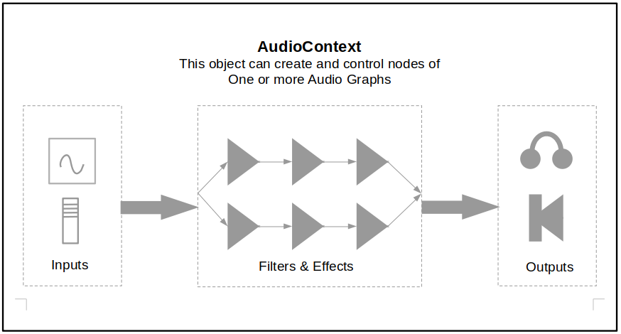

# Web Audio Mini Course - An Angular.io Demo

## Concepts

HTML has both the \<audio\> and \<video\> elements which easily allow playing both audio & video
content with controls. These elements are easy to incorporate into a page but do not offer a
lot of control over the media.

The WebAudio API allows for much more control over audio. Not only does it allow for
different sources and outputs, it also can include full effects and control chains as well as
analytics and complex processing of audio streams. One can easily build say a 32-channel
mixer board with individual EQ, PAN, REVERB and pipe this to a multiple bus output or build a
complex synthesizer using sine/square/triangle/ramp/lfo oscillators and other effects.

## A Simple Example

Any application starts with an instance of an AudioContext (or an OfflineAudioContext for off-
line processing). The audio context allows the creation of audio ‘nodes’ which are connected
to form one or more audio ‘graphs’. These graphs can be played or saved for further
processing.

```
  Const audioCtx = new window.AudioContext();
```
The audio context controls the routing and interaction of the nodes and for this
example we will be using 2 channels for stereo although more channels are
supported:



## Inputs

There are various ways to get input. We can put a track into an <audio> element and then
grab it:

```
// grab an audio element...
//
<audio src=”assets/C4.mp3”></audio>

const audioEl = document.querySelector('audio');
const mp3Track = audioCtx.createMediaElementSource(audioEl);
```
We now have an input node. OR we can load a buffer directly and put it in a buffer source
node:

```
// load a file into an audio buffer and then link it to a track...
//
await fetch('assets/A3.mp3')
  .then(mp3 => mp3.arrayBuffer())
  .then(mp3Buf => this.audioCtx2.decodeAudioData(mp3Buf))
  .then(audioBuf => this.mp3Track2Buf = audioBuf);

this.mp3Track2 = this.audioCtx2.createBufferSource();
this.mp3Track2.buffer = this.mp3Track2Buf;
```
There are other input types including oscillators and wave generators.

## Outputs

The audio context has a destination property – this is typically the speakers but can be files or streams. This demo
uses the speakers.

## In Between

The audio context offers many filters, effects, generators, side chains, and routing. Very complex
audio systems can be created. These nodes are inserted between the input and output

This demo uses:

- a gainNode – control the downstream level from 0 (muted) to 1 (full)
- a stereoPannerNode – control the levels of both left & right channels from -1 (full left)
    to 1 (full right)
- a convolverNode – this is a complex filter which we use for reverb. An impulse-response waveform is used to adjust the original source to mimic a particular environment.
- We also implement a ‘seek’ control by directly adjusting the .currentTime property on the
    playback

## Tying It Together

The nodes are chained by

```
  inputNode.connect(gainNode).connect(stereoPannerNode).connect(ctx.destination)
```


and the reverb node is inserted after the stereoPannerNode when toggled on.

## Playback

The following button (click)="toggleMp4Play()" code controls the button text and plays the video. We need to test
whether or not the source is already playing. Mp4IsPlaying is a flag property to control the button
text:

```
toggleMp4Play = () => {
  if (this.mp4IsPlaying) {
    this.mp4Track1.mediaElement.pause();
    this.mp4IsPlaying = false;
  } else {
    this.playMp4();
    this.mp4IsPlaying = true;
  }
}
```
this.playMp4 chains the nodes together and then calls

```
  this.mp4Track1.mediaElement.play()
```
## Summary

This is a very cursory look at the WebAudio API. This simple example will go a long way to
adding audio to apps. This is a typical angular.io app and uses @angular/material so make sure to: ng add @angular/material.

Anyone just looking to see the app and test it:

[WebAudio Demo App](https://hawkrdg.com/webaudio)

A very good place to start learning about the WebAudio API would be:

[MDN Using Web Audio](https://developer.mozilla.org/en-US/docs/Web/API/Web_Audio_API/Using_Web_Audio_API)
